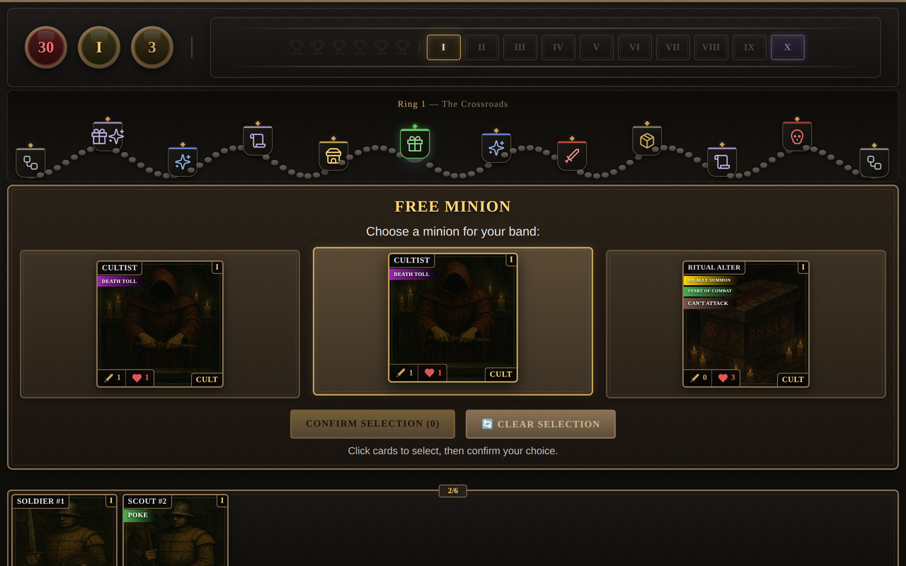
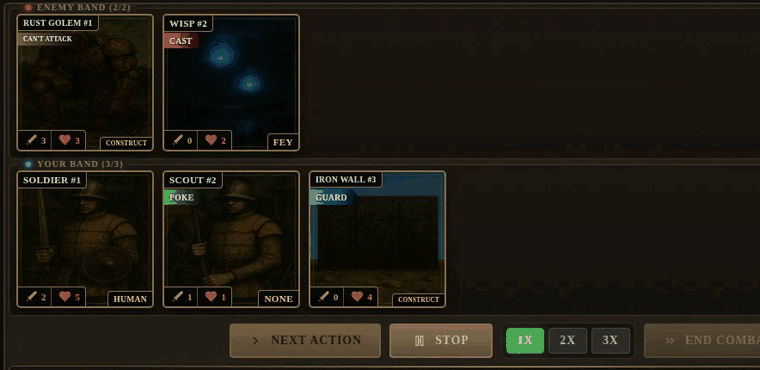
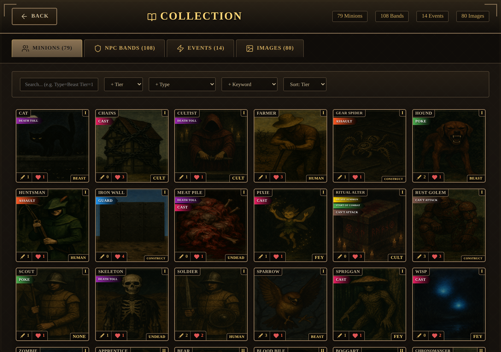
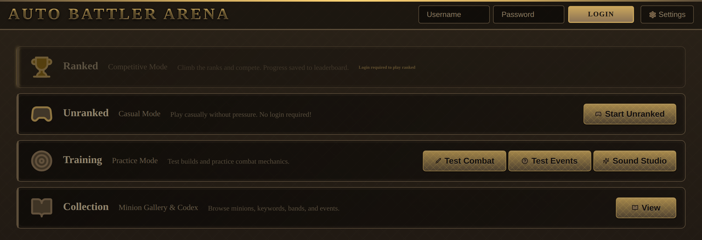
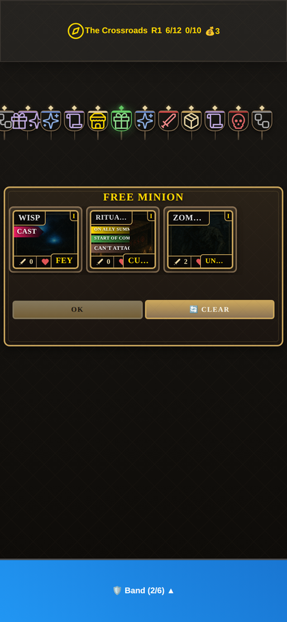

# Auto Battler Arena

A browser-based, asynchronous **auto-battler roguelike**. Build a band of minions with
keyword-driven abilities, navigate a ring of events (shops, buffs, combats), and fight
snapshots of other players' bands ("ghosts") to climb toward victory.

The game is **fully server-authoritative**: all combat and game logic runs in a Python
backend, and the browser client is a pure renderer that replays a command stream produced
by the server. This keeps the rules tamper-resistant and combat deterministic.

> **All rights reserved.** This source is published for reference and portfolio purposes
> only. No license is granted to use, copy, modify, or distribute this code or its assets.



---

## Gameplay

| | |
|---|---|
| **Genre** | Auto-battler roguelike (single-player vs. asynchronous ghosts) |
| **Content** | ~105 minions · 6 heroes · 7 themed zones · keyword-driven combat |
| **Platform** | Desktop and mobile web (responsive) |

**Core loop:** navigate a 12-event ring → shop and build your band → auto-resolve combats →
manage gold and synergies → fight a ghost battle every 10 events → upgrade rings and push
for the win.

### Screenshots

**Combat — bands auto-resolve turn by turn; step through or auto-play:**



**Collection — browse minions, keywords, tribes, and stats:**



| Main menu | Mobile |
|---|---|
|  |  |

## Architecture

```
Browser client (vanilla JS)              Python backend (Flask)
─────────────────────────────            ─────────────────────────────
index.html + js/                         app.py         — app factory, routing, safety gate
  game-core.js   API + state             routes.py      — game API (server-authoritative)
  combat.js      combat replay           game_engine/   — combat system, effects, triggers,
  ui/            rendering                                 events, selection, damage handling
  collection.js  meta screens            minions.py     — minion/keyword definitions
                                         models.py      — SQLAlchemy models (SQLite)
        │                                        │
        └──────── HTTP / JSON  ◀──────────────────┘
             (client replays server command stream)
```

- **Server-authoritative combat.** `game_engine/combat_system.py` resolves a fight into an
  ordered command stream with a state snapshot after each step. The client
  (`js/combat.js`) replays those snapshots — it never simulates combat itself.
- **Modular effect engine.** Keywords and abilities are data-driven and dispatched through
  a trigger/effect registry (`game_engine/effects/`, `game_engine/triggers/`).
- **Deterministic RNG** via `game_random.py`, enabling reproducible snapshot-replay tests.

## Getting started (local development)

Requirements: Python 3.11+ and Node.js (for the frontend test only).

```bash
cd Battlegrounds
python3 -m venv venv && source venv/bin/activate
pip install -r requirements.txt

# Configure (see Battlegrounds/.env.example for all options)
export SAFETY_PASSWORD=letmein        # access code for the safety gate
export SECRET_KEY=$(python3 -c "import secrets;print(secrets.token_urlsafe(48))")

python app.py                          # http://localhost:5000
```

On first run the console prints the safety access code (unless `SAFETY_PASSWORD` is set).
Enter it at `/safety-login` to reach the game.

### Create an account (optional — ranked play)

```bash
python scripts/make_invite.py --count 1     # mint an invite code
python scripts/add_user.py <username> <password>
```

## Running the tests

The maintained suite is a snapshot-replay harness that verifies the backend combat engine
and the frontend replayer produce identical state, step by step:

```bash
npm run test:snapshot      # backend (Python) + frontend (jsdom) snapshot tests
```

Individual backend test modules under `Battlegrounds/tests/` are run as standalone scripts,
e.g. `python3 Battlegrounds/tests/test_auth_security.py`.

## Deploying to production

The Flask development server (`python app.py`) is for local use only. For a real deployment:

1. Serve via a WSGI server behind a TLS reverse proxy:
   ```bash
   gunicorn -w 4 wsgi:app
   ```
2. Set the required environment variables (see [`Battlegrounds/.env.example`](Battlegrounds/.env.example)):
   a fixed `SECRET_KEY`, a fixed `SAFETY_PASSWORD`, and `SESSION_COOKIE_SECURE=true`
   once HTTPS is in place.
3. Serve `images/`, CSS, and JS as static assets from the proxy/CDN with caching.

Developer tooling (combat simulator, event/ghost editors) is disabled by default and only
mounts when `ENABLE_DEV_ROUTES=true` — never enable it in production.

## Repository layout

```
Battlegrounds/          Game application
  app.py                Flask app factory + entry point
  wsgi.py               Production WSGI entry point
  routes.py             Game API
  game_engine/          Combat, effects, triggers, events, selection
  js/                   Frontend (client renderer)
  images/               Minion/hero art
  scripts/              Admin CLIs (add_user, make_invite)
  tests/                Test suite
DOCS/                   Design and system documentation
```

## Documentation

- [`DOCS/EVENTS.md`](DOCS/EVENTS.md) — event system architecture and how to add events
- [`DOCS/SNAPSHOT_PLAYER.md`](DOCS/SNAPSHOT_PLAYER.md) — the snapshot-replay test system
- [`DOCS/TOOLTIP_KEYWORD_SYSTEM.md`](DOCS/TOOLTIP_KEYWORD_SYSTEM.md) — keyword/tooltip resolution
- [`DOCS/MINION_DISPLAY_CARDS.md`](DOCS/MINION_DISPLAY_CARDS.md) — minion card rendering
- [`DOCS/GAME_DESIGN.md`](DOCS/GAME_DESIGN.md) — full design and feature notes
